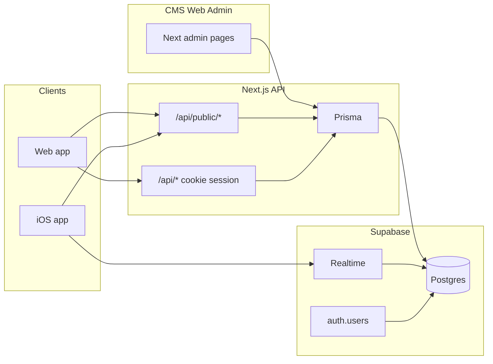

# Mobile / iOS backend context (Awake & Align)

**Parity guide (schedule, movement, audio, journal, nuances):** [MOBILE-APP-PARITY.md](./MOBILE-APP-PARITY.md)

This document describes how the **web app**, **CMS**, and **mobile clients** share one backend. Use it when wiring the iOS app to the same content users see on the web after admins edit cards, schedules, or broadcast prayers.

**Terminology:** The stack uses **Prisma** (ORM) against **PostgreSQL** on **Supabase**—not a separate product named “Prism.” Supabase also provides **Auth**, **`profiles`**, **Row Level Security (RLS)**, and **Realtime**.

**Related docs:** [SUPABASE-USER-MIGRATION.md](./SUPABASE-USER-MIGRATION.md) (project setup, migrations, RLS script). [VERIFY-CMS-BACKEND.md](./VERIFY-CMS-BACKEND.md) (confirm CMS writes land in the expected Supabase Postgres). Realtime filters for the schedule week match [ScheduleWeekRealtime.tsx](../src/app/(app)/(main-tabs)/schedule/ScheduleWeekRealtime.tsx).

---

## Architecture (single source of truth)



- **CMS** writes through Next.js **admin** route handlers (`/api/admin/*`) using Prisma. There is no separate CMS database.
- **Catalog and schedule content** live in Postgres; **public read APIs** under `/api/public/*` return JSON suitable for mobile (CORS enabled).
- **Live updates:** The web schedule tab subscribes to Supabase **Realtime** on `schedule_day` and `week_schedule` so CMS edits appear without a full reload. iOS can use the **same** Realtime filters and then **re-fetch** `/api/public/schedule` (or poll if Realtime is skipped).

---

## Configuration (what to put in the iOS / Expo app)

| Variable | Purpose |
|----------|---------|
| **API base URL** | Origin of the deployed Next app, e.g. `https://<your-production-domain>`. All `/api/public/*` paths below are appended to this origin. In Expo, this is often `EXPO_PUBLIC_WEB_API_URL` (same value). |
| **`NEXT_PUBLIC_SUPABASE_URL`** | Same value as the web app (Supabase project URL). |
| **`NEXT_PUBLIC_SUPABASE_ANON_KEY`** | Same value as the web app (publishable anon key). Used by the Supabase Swift client for Auth, Realtime, and PostgREST (RLS applies). |

**Never** embed `DATABASE_URL`, **service role**, or other server-only secrets in a mobile client.

Implementation reference (web): [src/lib/supabase/env.ts](../src/lib/supabase/env.ts).

### Movement / Audio tabs (catalog)

Use **`GET`** on the deployed origin:

- **Schedule:** `/api/public/schedules`, `/api/public/schedule?weekStart=...`
- **Movement landing + library:** `/api/public/movement-layout`, `/api/public/workouts`, `/api/public/workouts/[id]`
- **Audio layout + prayers:** `/api/public/audio-layout`, `/api/public/prayers`, `/api/public/prayers/[id]`
- **Daily verse:** `/api/public/daily-verse?date=...`

**Stay fresh after CMS edits:** subscribe to **Supabase Realtime** on the tables listed [below](#supabase-realtime-stay-in-sync-after-cms-edits), then **re-fetch** the same public URLs (debounce bursts if needed). Reference: [MovementLibraryRealtime.tsx](../src/app/(app)/(main-tabs)/movement/MovementLibraryRealtime.tsx).

---

## CMS area → Postgres (Prisma) → how mobile reads it

| Product area | Prisma models (`prisma/schema.prisma`) | Read path for mobile |
|--------------|----------------------------------------|----------------------|
| Weekly schedule (day cards, media, copy) | `WeekSchedule`, `ScheduleDay` | `GET /api/public/schedule?weekStart=<ISO>`; list weeks: `GET /api/public/schedules` |
| Movement landing (hero, quickies, copy) | `MovementLandingCopy`, `MovementHeroTile`, `MovementQuickieCard` | `GET /api/public/movement-layout` |
| Prayer / audio **library layout** (tiles, collections) | `AudioCollectionCard`, `AudioEssentialTile` | `GET /api/public/audio-layout` |
| Prayer **audio catalog** | `PrayerAudio` | `GET /api/public/prayers`, `GET /api/public/prayers/[id]` |
| Workouts | `Workout` | `GET /api/public/workouts`, `GET /api/public/workouts/[id]` |
| Daily verse | `DailyVerse` | `GET /api/public/daily-verse?date=` |

Admin routes that mutate the above live under `src/app/api/admin/` (e.g. schedules, workouts, prayer audio, audio collections, movement tiles).

---

## Public HTTP API reference

All `/api/public/*` routes use **GET** (and **OPTIONS** for CORS preflight). Responses set `Access-Control-Allow-Origin: *` and allow `Content-Type` and `Authorization` headers ([src/lib/public-json.ts](../src/lib/public-json.ts)).

Base URL: `{API_ORIGIN}` = your deployed site origin (scheme + host, no trailing slash).

### `GET {API_ORIGIN}/api/public/schedules`

Lists week rows for pickers (newest first, up to 52).

**200 JSON:**

```json
{
  "schedules": [
    { "id": "<uuid>", "weekStart": "<ISO-8601 datetime>" }
  ]
}
```

### `GET {API_ORIGIN}/api/public/schedule?weekStart=<optional ISO date>`

Resolves the schedule whose Monday matches the anchor date. If `weekStart` is omitted, the server uses “now” (see implementation).

**Query:** `weekStart` — optional; must parse as a valid date or response is **400** with `{ "error": "Invalid weekStart" }`.

**200 JSON (no schedule for that week):**

```json
{ "week": null }
```

**200 JSON (success):**

```json
{
  "week": {
    "id": "<uuid>",
    "weekStart": "<ISO-8601 datetime>",
    "days": [
      {
        "id": "<uuid>",
        "dayIndex": 0,
        "prayerTitle": "<string | null>",
        "prayerId": "<uuid | null>",
        "workoutTitle": "<string | null>",
        "workoutId": "<uuid | null>",
        "affirmationText": "<string | null>",
        "dayImageUrl": "<string | null>",
        "dayVideoUrl": "<string | null>",
        "daySubtext": "<string | null>",
        "movementIntroHeadline": "<string | null>",
        "movementIntroSubtext": "<string | null>"
      }
    ]
  }
}
```

`movementIntroHeadline` and `movementIntroSubtext` match the web pre-workout screen copy on `ScheduleDay` (Postgres: `movement_intro_headline`, `movement_intro_subtext`).

### `GET {API_ORIGIN}/api/public/movement-layout`

**200 JSON:**

```json
{
  "copy": {
    "justStartedTagline": "<string>",
    "quickieIntro": "<string>"
  },
  "heroTiles": [
    {
      "id": "<uuid>",
      "title": "<string>",
      "subtitle": "<string>",
      "imageUrl": "<string>",
      "videoUrl": "<string>",
      "sortOrder": 0
    }
  ],
  "quickieCards": [
    {
      "id": "<uuid>",
      "title": "<string>",
      "metaLine": "<string>",
      "imageUrl": "<string>",
      "summary": "<string>",
      "videoUrl": "<string>",
      "sortOrder": 0
    }
  ]
}
```

### `GET {API_ORIGIN}/api/public/audio-layout`

**200 JSON:**

```json
{
  "collections": [
    {
      "id": "<uuid>",
      "title": "<string>",
      "metaLine": "<string>",
      "imageUrl": "<string>",
      "summary": "<string>",
      "linkHref": "<string>",
      "sortOrder": 0
    }
  ],
  "essentials": [
    {
      "id": "<uuid>",
      "title": "<string>",
      "subtitle": "<string>",
      "imageUrl": "<string>",
      "linkHref": "<string>",
      "sortOrder": 0
    }
  ]
}
```

### `GET {API_ORIGIN}/api/public/prayers`

**200 JSON:**

```json
{
  "prayers": [
    {
      "id": "<uuid>",
      "title": "<string>",
      "description": "<string | null>",
      "scripture": "<string | null>",
      "audioUrl": "<string>",
      "duration": 0,
      "coverImageUrl": "<string | null>"
    }
  ]
}
```

### `GET {API_ORIGIN}/api/public/prayers/{id}`

**404:** `{ "error": "Not found" }`

**200 JSON:**

```json
{
  "prayer": {
    "id": "<uuid>",
    "title": "<string>",
    "description": "<string | null>",
    "scripture": "<string | null>",
    "audioUrl": "<string>",
    "duration": 0,
    "coverImageUrl": "<string | null>"
  }
}
```

### `GET {API_ORIGIN}/api/public/workouts`

**200 JSON:**

```json
{
  "workouts": [
    {
      "id": "<uuid>",
      "title": "<string>",
      "duration": 0,
      "category": "<string | null>",
      "scripture": "<string | null>",
      "videoUrl": "<string>",
      "thumbnailUrl": "<string | null>"
    }
  ]
}
```

Note: The `Workout` model includes **`instructor`** in the DB; this list endpoint does **not** return it. Use `GET /api/public/workouts/{id}` if you need a single workout—verify fields there—or read via PostgREST.

### `GET {API_ORIGIN}/api/public/workouts/{id}`

**404:** `{ "error": "Not found" }`

**200 JSON:**

```json
{
  "workout": {
    "id": "<uuid>",
    "title": "<string>",
    "duration": 0,
    "category": "<string | null>",
    "scripture": "<string | null>",
    "videoUrl": "<string>",
    "thumbnailUrl": "<string | null>"
  }
}
```

### `GET {API_ORIGIN}/api/public/daily-verse?date=<optional YYYY-MM-DD or ISO>`

**200 JSON (no verse):**

```json
{ "verse": null }
```

**200 JSON (success):**

```json
{
  "verse": {
    "id": "<uuid>",
    "verseDate": "<ISO-8601 datetime>",
    "reference": "<string>",
    "text": "<string>",
    "translation": "<string | null>"
  }
}
```

There is also `GET /api/daily-verse` on the web app with the same verse shape; prefer **`/api/public/daily-verse`** for mobile if you need CORS from a browser-based shell.

---

## Supabase Realtime (stay in sync after CMS edits)

The migration [supabase/migrations/20260407170000_rls_auth_realtime.sql](../supabase/migrations/20260407170000_rls_auth_realtime.sql) adds these **`public`** tables to the `supabase_realtime` publication:

- `week_schedule`
- `schedule_day`
- `workout`
- `prayer_audio`
- `daily_verse`
- `audio_collection_card`
- `audio_essential_tile`
- `movement_landing_copy`
- `movement_hero_tile`
- `movement_quickie_card`

### Schedule week (same filters as the web client)

Subscribe with the Supabase Swift client (anon key + user session if required by your project). For the **active** week id `weekScheduleId`:

- **Table** `schedule_day`, **filter** `week_schedule_id=eq.<weekScheduleId>`
- **Table** `week_schedule`, **filter** `id=eq.<weekScheduleId>`

On any `INSERT` / `UPDATE` / `DELETE`, **re-fetch** `GET /api/public/schedule?weekStart=...` for that week (or refetch other `/api/public/*` endpoints if you subscribed to those tables).

Reference implementation: [ScheduleWeekRealtime.tsx](../src/app/(app)/(main-tabs)/schedule/ScheduleWeekRealtime.tsx).

---

## Auth: web cookies vs native JWT (important)

- **Web session:** [src/auth.ts](../src/auth.ts) uses Supabase with **HTTP cookies**. Many route handlers use [`requireAuth()`](../src/lib/auth.ts) for cookie sessions.
- **Native clients** typically send **`Authorization: Bearer <access_token>`** (Supabase Auth access token).

**Prayer journal Next APIs** (`/api/prayer-journal`, `/api/prayer-journal/[id]`, `/api/prayer-journal/upload`, `/api/prayer-journal/tag-suggestions`) use [`requireAuthFromRequest()`](../src/lib/auth.ts): **cookie session OR Bearer token** validated with `supabase.auth.getUser(token)`. Mobile can call the **same** routes as the web app when the access token is sent on each request.

### Practical options for iOS (other user data)

1. **Supabase + PostgREST (RLS)**  
   Use the Supabase Swift SDK with the user’s JWT. Read/write rows where RLS allows: e.g. `prayer_journal_entry` (if you bypass Next APIs), `user_day_completion`, `user_workout_completion`, `user_prayer_completion`, `prayer_reminder`, and `profiles` (see policies in `20260407170000_rls_auth_realtime.sql`).

2. **Next API parity**  
   Routes that still use **cookie-only** `requireAuth()` (e.g. some schedule completion endpoints) may need the same Bearer treatment as prayer journal if native clients must use them—track those per route.

### Broadcast prayers (CMS)

Admins send **broadcast** journal entries via `POST /api/admin/prayer-journal/broadcast` ([route](../src/app/api/admin/prayer-journal/broadcast/route.ts)), which inserts rows into **`prayer_journal_entry`** for each user. On mobile, those appear like any other journal row for the signed-in user when journal data is loaded (PostgREST + RLS or **`/api/prayer-journal`** with Bearer).

---

## Optional: direct Supabase PostgREST reads

RLS policies in `20260407170000_rls_auth_realtime.sql` mark many catalog tables as **world-readable** (`SELECT USING (true)`). You can query them with the anon key if you need columns **not** exposed by `/api/public/*`.

If you need **extra** `schedule_day` columns not yet exposed on `/api/public/schedule`, read them via PostgREST with filters on `week_schedule_id` aligned with your active week.

---

## Summary checklist for iOS engineers

1. Point HTTP client at `{API_ORIGIN}` and consume **`/api/public/*`** for CMS-backed catalog and schedule (JSON shapes above).
2. Configure Supabase Swift with **URL + anon key**; use **Realtime** on the tables you care about, then refetch the matching public endpoints.
3. For **prayer journal** via Next APIs, send **`Authorization: Bearer <Supabase access token>`** to `/api/prayer-journal*` (see [`requireAuthFromRequest`](../src/lib/auth.ts)). Alternatively use **PostgREST + RLS** only.
4. For **other** signed-in Next routes, confirm each route supports Bearer or use **Supabase + RLS** until parity is added.
